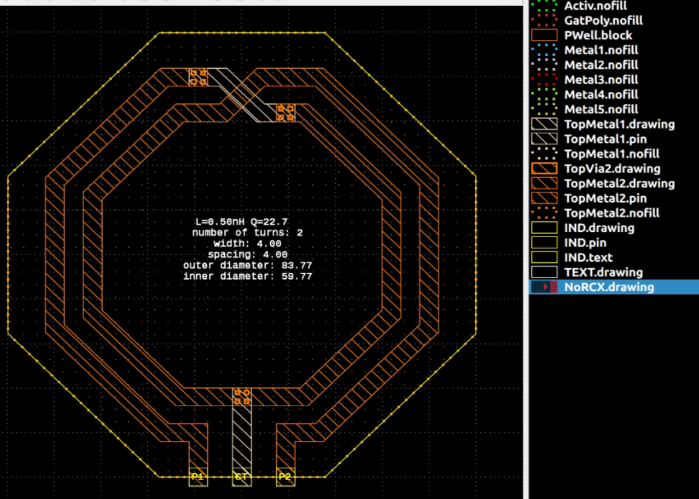

# Inductor synthesis IHP inductor2/inductor3 using gds2palace

The gds2palace example provided here creates a symmetric inductor2/inductor3 layout in IHP SG13G2 technology fully automatically, based on a target L value at a target frequency. The geometry sweep range where possible implementations are evaluated is defined in the model code: range for width, spacing, number of turns.  

New in this version: The layout is created by code in the model file, there is no need for an external library.




## Principle of operation

This is what this script does for you:

- Step 1: Determine list of possible implementations based on close form equations, by calculating the required diameter and testing if this layout is valid and within a given maximum diameter limit. 
- Step 2: Create GDSII layouts for all these candidates (including ports + ground return) 
- Step 4: Run a fast FEM sweep over all candidates using gds2palace
- Step 5: Evaluate the n candidates with highest Q factor at target frequency and re-tune to target value at target frequency
- Step 6: After m iterations over step 5, select the candidate with the highest Q factor and do a wideband full sweep using gds2palace FEM with full accuracy.
- Step 7: Plot results for L and Q factor of that best candidate
- Step 8: Create a final GDSII file with all extra layout features required for SG13G2 OPDK.

The gds2palace FEM simulation flow runs in non-GUI mode here, so that there is no user action required while the script is processing data. 


## Usage

Acticate the Python venv where you can run gds2palace models. gds2palace must be installed as a Python module: pip install gds2palace. The Palace solver must be available and you must be able to run gds2palace models. If you are not familar with gds2palace, go to the gds2palace documentation [here](https://github.com/VolkerMuehlhaus/gds2palace_ihp_sg13g2).

In the `synthesize_ihp_inductor_v1.py` script, set your target L value and target frequency, and adjust the search range for w,s and number of turns. Then just run the Python script.

### Inductor target and geometry range
The code snippet below shows where inductor design goals and geometry sweep range are defined

```python
# CREATE INDUCTOR WITH TARGET VALUE
Ltarget = 0.5e-9 # target inductance in H
ftarget = 40e9  # design frequency in Hz
faked_dc = 0.1e9  # do not change, this is the "DC-like" low frequency for data extraction

w_range = [2.01,4,6,8,10,12,15] # sweep over these width values 
s_range = [2.01,4,6]
nturns_range = [2,3]
dout_max = 300 # maximum outer diameter in microns

layout_with_centertap = False # layout with or without center tap

# CREATE INDUCTOR WITH TARGET VALUE
Ltarget = 0.5e-9 # target inductance in H
ftarget = 40e9  # design frequency in Hz

w_range = [2.01,4,6,8,10,12,15] # sweep over these width values 
s_range = [2.01,4,6]
nturns_range = [2,3]
dout_max = 300 # maximum outer diameter in microns

layout_with_centertap = False # layout with or without center tap
```

The code snippet below shows some design flow control settings: 
To speed up the simulation, the initial models are run with FEM order=1, and then FEM order=2 is used for fine tuning and the final wideband sweep. After the initial sweep over all geometry candidates, the best 2 results are refined further, using 2 finetune steps.

```python
initial_sweep_FEM_order = 1  # many candicates are simulated here, order=1 is faster but less accurate
finetune_FEM_order = 2  # user oder=2 for accurate results from finetune step

how_many_top_results = 2  # number of best inductors from initial sweep that are evaluated more closely and re-tuned to target
how_many_finetune_steps = 2 # how many iteration of tune-to-target before selecting the final candidate for full frequency sweep
```

The code snippet below shows where basic EM simulation settings for gds2palace are defined, including the mesh refinement at the edges:
```python
settings['preprocess_gds'] = True
settings['merge_polygon_size'] = 1.5

settings['refined_cellsize'] = 5  # mesh cell size in conductor region
settings['adaptive_mesh_iterations'] = 0  # Palace adative mesh iterations
```


## Change history

07-April-2026: New version with built-in inductor geometry code, no external geometry library required. No limit on number of turns.


